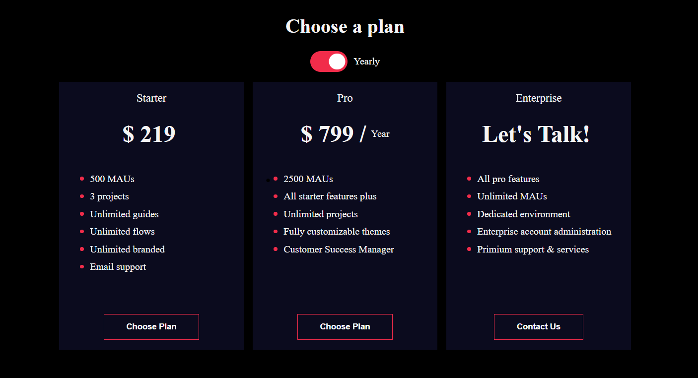
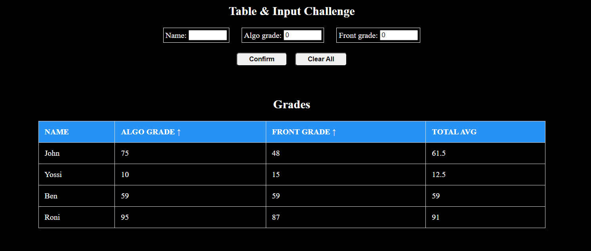

# FrontEnd-Exercises

## FrontEnd Exercises with React js , HTML & CSS

---

<!--    -->
  

    <h3>Payment Landing Page</h3>
  

  

  ---
  

    <h3>Pricing Plan</h3>
  

 
 
  ---
  

    <h3>Grades Input & Table</h3>
  

 

---

